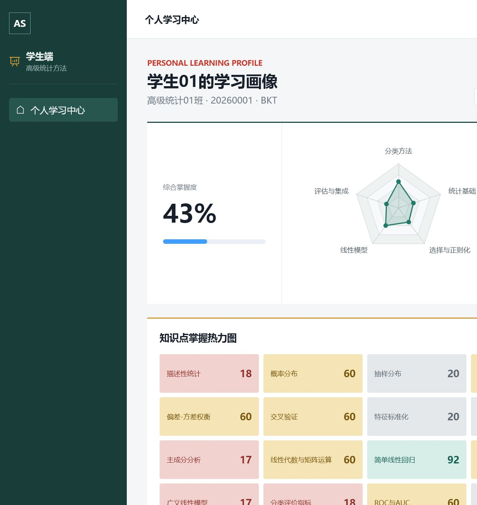
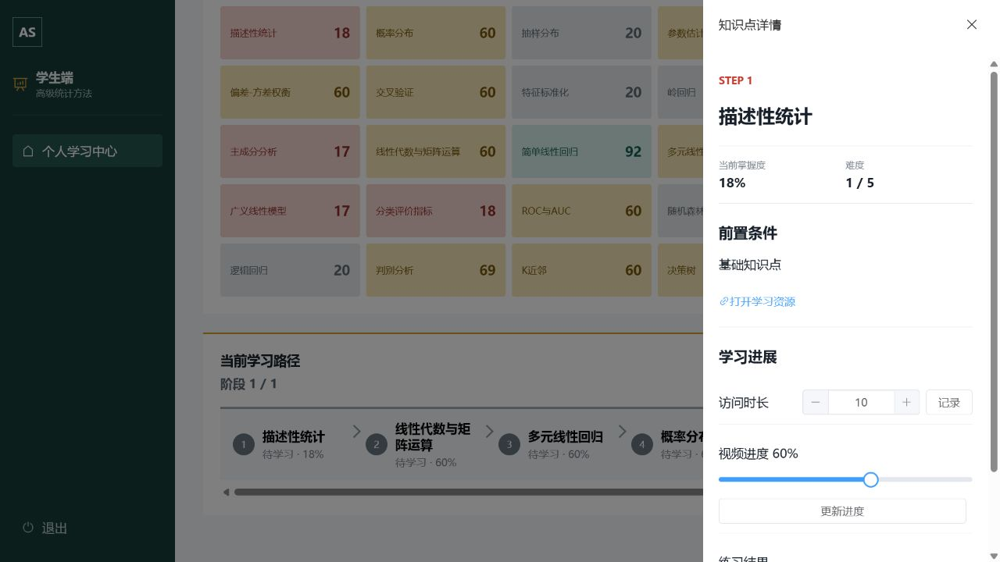
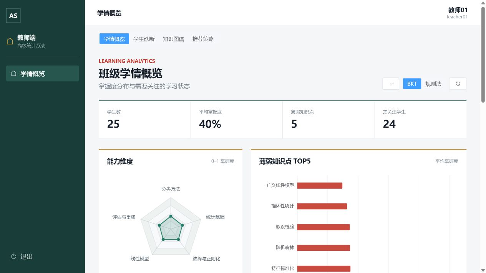
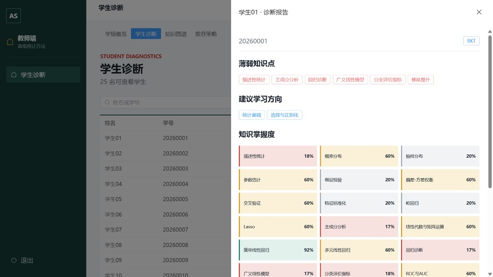
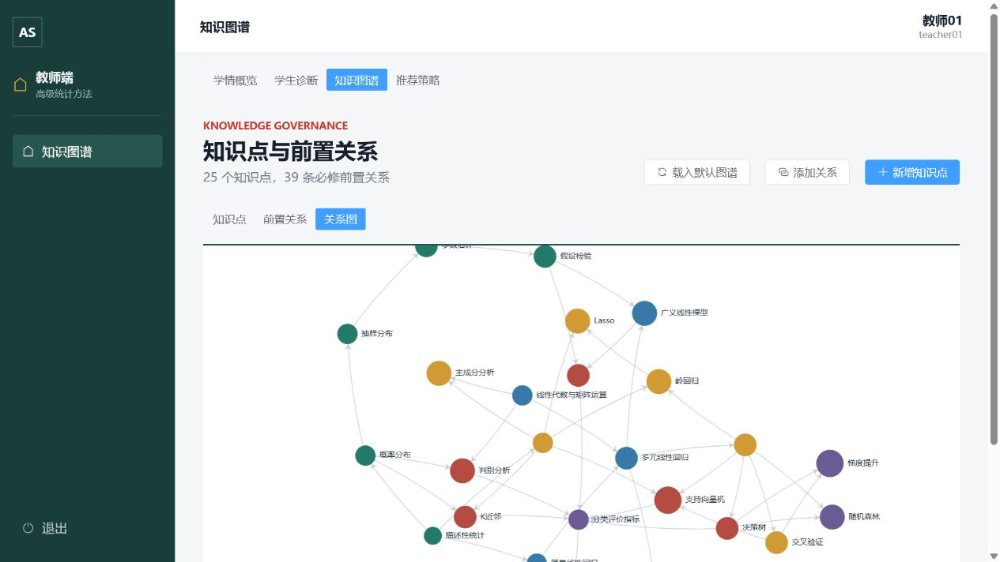
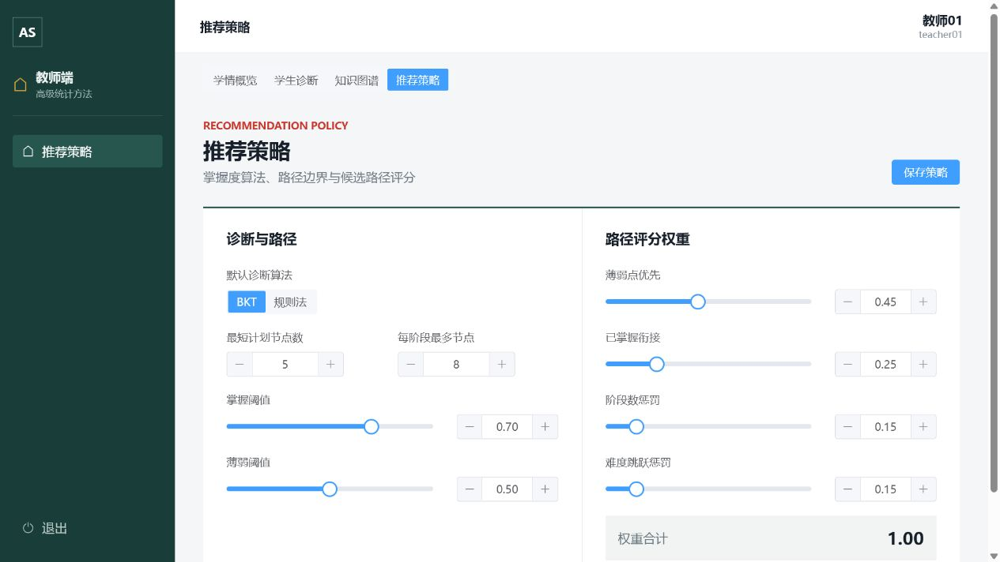
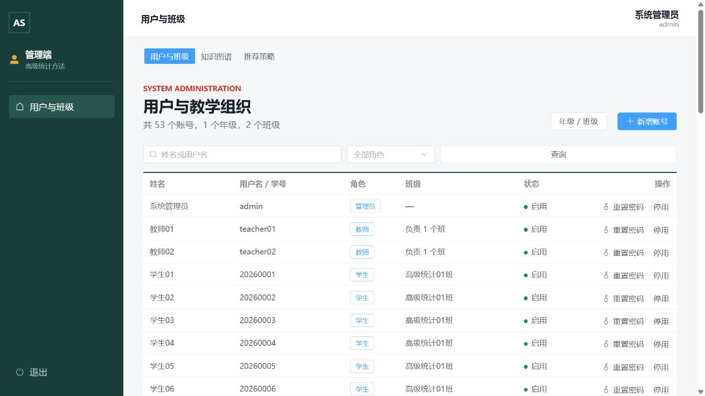
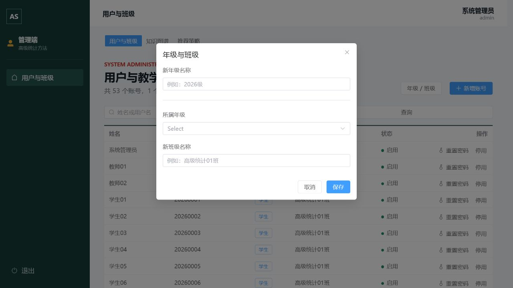

# 高级统计课程知识图谱学习路径推荐系统用户操作手册

| 项目 | 内容 |
|---|---|
| 适用版本 | `v1.2.0` |
| 使用方式 | 本机浏览器访问 |
| 系统地址 | `http://127.0.0.1:8000` |
| 更新日期 | 2026-07-22 |

本手册面向学生、教师和系统管理员，说明日常使用流程、主要界面、操作结果和注意事项。环境安装、服务启动、数据库重置及测试命令见 [运行手册](./运行手册.md)。

## 1. 使用前准备

1. 请确认维护人员已经启动系统，浏览器能够访问 `http://127.0.0.1:8000`。
2. 建议使用最新版 Chrome、Edge 或 Firefox，浏览器缩放保持 `100%`。
3. 本地演示账号如下。系统关闭公开注册，正式账号由管理员创建。

| 角色 | 用户名 | 密码 | 可访问范围 |
|---|---|---|---|
| 管理员 | `admin` | `Admin@123456` | 全部账号、教学组织、知识图谱和推荐策略 |
| 教师 1 | `teacher01` | `Teacher@123456` | 高级统计 01 班个人数据及 2026 级匿名聚合 |
| 教师 2 | `teacher02` | `Teacher@123456` | 高级统计 02 班个人数据及 2026 级匿名聚合 |
| 学生 | `20260001` - `20260050` | `Student@123456` | 仅本人画像、路径和学习行为 |

手册截图使用固定种子生成的模拟账号与学习数据，不包含真实个人信息。学习行为提交后，界面中的百分比、人数和路径可能与截图不同。

## 2. 登录与退出

图 1 系统登录页

### 2.1 登录

1. 在浏览器地址栏输入 `http://127.0.0.1:8000`。
2. 在“用户名”中输入管理员分配的用户名或学生学号。
3. 在“密码”中输入对应密码。
4. 单击“进入系统”。系统会根据账号角色自动进入学生端、教师端或管理端。

登录失败时，先检查用户名、密码大小写和账号状态。连续失败不会切换角色；账号被停用后也无法登录。

### 2.2 页面结构与退出

- 左侧为当前角色和功能区，顶部右侧显示登录人姓名与账号。
- 教师端和管理端通过页面上方页签切换功能，不需要重复登录。
- 使用完毕后单击左下角“退出”。尤其在共用电脑上，不要直接关闭页面代替退出。

## 3. 学生端操作

学生端推荐流程为：查看画像 -> 选择学习目标 -> 生成路径与完整前置依赖图 -> 按阶段学习 -> 提交练习 -> 自动获得原目标的更新路径。

### 3.1 查看个人学习画像

图 2 学生个人学习中心

登录后进入“个人学习中心”，可查看以下信息：

- “综合掌握度”是当前诊断算法下 25 个启用知识点掌握度的平均值。
- 能力雷达图汇总统计基础、线性模型、选择与正则化、分类方法、评估与集成五个维度。
- “当前薄弱点”列出掌握度低于薄弱阈值的知识点，“建议学习方向”汇总需要优先提升的能力维度。
- 知识点热力图中的数字为掌握度百分比。默认状态为：无有效证据“未学习”、低于 `50%`“薄弱”、`50%` 至 `69%`“学习中”、`70%` 及以上“掌握”。阈值以当前推荐策略配置为准。

### 3.2 生成学习路径

1. 在页面右上方的目标下拉框中搜索或选择目标知识点。
2. 单击“生成路径”，等待页面提示生成成功。
3. 在“当前学习路径”中从左到右、按“阶段 1/N”到“阶段 N/N”依次学习。
4. 在“目标前置依赖图”中查看目标的全部直接和间接祖先；箭头方向为“前置知识 -> 后续知识”。填充色表示掌握状态，绿色粗边框表示个性化路径节点，红色粗边框表示目标节点，虚线节点表示已停用知识点。
5. 可拖动画布、缩放或单击“适应画布”图标；单击节点可查看掌握度、难度、直接前置条件和学习资源。
6. 路径节点标注“已掌握”“待学习”或“目标”，目标节点排在完整计划最后。

系统会纳入目标所需的全部未掌握前置知识。依赖较多时会自动拆成多个阶段；浅层目标可能返回短路径；目标已经掌握时会返回单节点复习计划。每次新建路径后，页面只把最新有效路径作为当前计划展示。

### 3.3 查看知识点并记录学习进展

图 3 学习路径节点详情与反馈面板

1. 单击路径中的任一知识点节点，右侧打开“知识点详情”。
2. 查看当前掌握度、难度和前置条件。
3. 单击“打开学习资源”可在新页打开外部资料；访问外部资料需要联网。
4. 完成一次学习后，在“访问时长”填写本次实际分钟数，单击“记录”。取值范围为 1 至 120 分钟。
5. 拖动“视频进度”到当前实际进度，单击“更新进度”。取值范围为 `0%` 至 `100%`。
6. 每完成一道练习，选择“正确”或“错误”，单击“提交结果”。
7. 看到“练习结果已保存，学习路径已自动更新”后，抽屉会关闭，页面直接显示按原目标重算的新路径；继续提交新路径节点练习时无需再次单击“生成路径”。

学习反馈的统计方式需要特别注意：

- 每次单击访问“记录”都会新增一条独立访问记录。规则法累计访问次数和访问时长，3 次访问、累计 30 分钟即达到这两项的归一化上限。不要把同一次学习反复记录。
- 视频进度按“学生 + 知识点”覆盖保存，不会把多次百分比相加；当前规则法和 BKT 不直接把视频进度计入掌握度。
- 每次单击“提交结果”都会新增一次练习作答。规则法和 BKT 都会使用练习序列，不要重复提交同一道题。
- 规则法使用练习正确率、累计访问频次和累计访问时长；BKT 使用按时间排序的练习正确/错误序列。教师或管理员切换默认算法后，页面分数可能发生明显变化。

## 4. 教师端操作

教师端包含“学情概览”“学生诊断”“知识图谱”“推荐策略”四个功能区。教师只能查看所负责班级的学生个人数据，但可以查看所在年级的匿名聚合数据。

### 4.1 查看班级或年级学情

图 4 教师学情概览

1. 进入“学情概览”。
2. 在右上方范围下拉框选择负责班级或所在年级。
3. 选择 `BKT` 或“规则法”，单击刷新图标。
4. 查看学生数、平均掌握度、薄弱知识点数和需关注学生数。
5. 对照能力维度雷达图、薄弱知识点 TOP5 和关注学生列表安排教学。

年级范围只返回匿名聚合信息，不提供未负责班级学生的姓名、学号或个人诊断。

### 4.2 检索学生并查看诊断

图 5 学生诊断详情

1. 切换到“学生诊断”。
2. 选择 `BKT` 或“规则法”，在搜索框输入姓名或学号；需要时再选择负责班级。
3. 单击“查询”，在结果表中核对学生姓名、学号、班级和平均掌握度。
4. 单击目标学生所在行或操作列“详情”，右侧打开诊断报告。
5. 查看薄弱知识点、建议学习方向和 25 个知识点掌握度。
6. 如需代学生规划，在抽屉底部选择目标知识点并单击“生成”，按阶段查看结果。

若单击“详情”后未出现面板，请先刷新页面并重试；仍失败时确认该生属于当前教师负责班级，并检查服务是否仍在运行。

### 4.3 维护知识图谱

图 6 知识图谱关系视图

教师和管理员均可进入“知识图谱”，通过“知识点”“前置关系”“关系图”三个视图完成管理。

#### 新增或编辑知识点

1. 在“知识点”视图按名称、编码、章节或难度查询。
2. 单击“新增知识点”，填写名称、唯一编码、章节、能力维度、难度、学习资源链接和简介。
3. 单击“保存”。编辑现有知识点时，在目标行单击编辑图标后修改并保存。

#### 新增或编辑前置关系

1. 单击“添加关系”，分别选择“前置知识点”和“目标知识点”。方向表示“学习目标知识点前，必须先学习前置知识点”。
2. 单击“添加”。系统会拒绝自环、重复关系和会产生环路的关系。
3. 在“前置关系”视图可使用编辑或删除图标维护现有关系。
4. 切换到“关系图”检查整体依赖方向和节点分布。

“载入默认图谱”用于补充缺失的默认知识点。删除知识点会同时删除相关前置关系和学习数据，并使相关诊断、路径失效；确认前应核对名称，必要时先重置演示数据或备份数据库。

### 4.4 配置诊断与推荐策略

图 7 推荐策略配置

1. 进入“推荐策略”，选择默认诊断算法 `BKT` 或“规则法”。
2. 设置“最短计划节点数”和“每阶段最多节点”，允许范围均为 1 至 12。
3. 设置掌握阈值和薄弱阈值，薄弱阈值必须小于掌握阈值。
4. 设置薄弱点优先、已掌握衔接、阶段数惩罚、难度跳跃惩罚四项权重。
5. 确认“权重合计”为 `1.00`，单击“保存策略”。

保存成功后，现有当前路径会标记为待更新。学生需要重新生成路径，教师也需要重新打开或生成目标学生的路径。建议在课程演示前统一配置，避免演示中途大范围改变结果。

## 5. 管理员端操作

管理员端包含“用户与班级”“知识图谱”“推荐策略”。后两个功能区的操作与教师端一致。

### 5.1 查询和维护账号

图 8 管理员账号列表

1. 在“用户与班级”中输入姓名或用户名，可结合角色筛选后单击“查询”。
2. 单击“新增账号”，填写姓名、用户名、角色和初始密码。
3. 创建学生时，还必须填写学号并选择班级。
4. 创建教师时，可选择一个或多个负责班级。
5. 单击“创建”，看到“账号已创建”后在列表中确认结果。

账号列表会直接显示学生所属班级；教师负责多个班级时，会逐项显示年级和班级名称。操作列提供以下入口：

- “详情”：打开用户抽屉，查看用户名、角色、状态、学号或具体负责班级。单击“编辑”后可修改用户名、姓名、账号状态，以及学生学号/班级或教师负责班级；角色不可修改。
- “停用”：账号立即无法登录；再次单击“启用”可恢复登录。

详情抽屉还提供以下操作：

- “重置密码”：把学生、教师、管理员密码分别重置为 `Student@123456`、`Teacher@123456`、`Admin@123456`。执行前必须核对目标用户，并告知对应用户。
- “删除用户”：确认后永久删除账号。删除学生会同步删除该学生的访问、练习、视频、诊断和学习路径数据；该操作不可撤销。

系统禁止当前管理员停用或删除自己的账号。若账号角色创建错误，删除错误账号后按正确角色重新创建。

### 5.2 创建年级和班级

图 9 年级与班级管理

1. 单击页面右上方“年级 / 班级”。
2. 仅创建年级时，填写“新年级名称”，其他字段留空。
3. 创建班级时，选择“所属年级”并填写“新班级名称”。如果所属年级尚不存在，先保存新年级，再次打开窗口创建班级。
4. 单击“保存”，返回账号页后确认顶部年级、班级数量已更新。

### 5.3 管理知识与推荐策略

管理员可切换到“知识图谱”和“推荐策略”，操作步骤分别见 4.3 和 4.4。图谱删除、关系变更和策略保存会影响全部学生，建议由单一管理员在备份后集中操作。

## 6. 权限与数据影响

| 操作 | 学生 | 教师 | 管理员 | 主要影响 |
|---|:---:|:---:|:---:|---|
| 查看本人画像与提交反馈 | 是 | 否 | 否 | 路径节点练习自动更新原目标路径；其他反馈使旧路径待更新 |
| 查看负责班级学生诊断 | 否 | 是 | 否 | 只读诊断，可代生成路径 |
| 查看年级匿名聚合 | 否 | 是 | 否 | 不返回未负责班级个人信息 |
| 管理知识图谱 | 否 | 是 | 是 | 关系或节点变更会使相关路径失效 |
| 修改推荐策略 | 否 | 是 | 是 | 全部当前路径待更新 |
| 管理账号、年级和班级 | 否 | 否 | 是 | 影响登录、学生数据与教师负责范围 |

## 7. 常见问题

### 7.1 页面无法打开

确认地址为 `http://127.0.0.1:8000`，并请维护人员检查系统进程。首次安装、端口占用和启动失败处理见 [运行手册](./运行手册.md#10-常见故障排查)。

### 7.2 登录后进入了错误页面

系统根据账号角色自动跳转，无法手动访问其他角色页面。请退出并使用正确账号；若账号角色配置错误，由管理员删除错误账号后重新创建。

### 7.3 学习路径为空或仍显示旧结果

先选择目标并单击“生成路径”。提交当前路径节点的练习后，系统会自动按原目标显示更新路径；访问记录、视频进度、图谱修改或推荐策略保存仍会使旧路径变为待更新，需要再次生成。若系统提示无法生成有效路径，请教师检查前置关系是否完整。

### 7.4 掌握度为什么很快达到 100%

访问记录和练习记录是累计证据。反复记录同一次访问或反复提交同一道正确练习，会被视为多次新行为；规则法的访问项很快达到上限，连续正确练习也会使 BKT 快速上升。请只记录真实发生的一次学习或作答。视频进度是覆盖值，本身不会直接提高当前两种算法的掌握度。

### 7.5 教师搜索不到某名学生

教师只能检索自己负责班级的学生。管理员可在用户列表单击“详情”，进入编辑状态后调整教师负责班级；需要查看其他班级个人信息时，应由对应负责教师登录。

### 7.6 保存前置关系或推荐策略失败

- 前置关系：检查是否为自环、重复关系或会形成环路。
- 推荐策略：检查薄弱阈值是否小于掌握阈值，四项权重之和是否为 `1.00`。

### 7.7 如何恢复演示初始数据

数据重置会删除当前学习行为、诊断、路径和账号变更。请联系维护人员按照 [运行手册的“重置固定种子数据”](./运行手册.md#72-重置固定种子数据) 执行，不要在保留有效数据的环境中直接重置。

## 8. 操作检查清单

### 学生

- 已确认当前登录姓名和学号。
- 已选择目标并生成路径。
- 已按阶段学习，只提交真实发生的访问、视频进度和练习结果。
- 提交路径节点练习后已确认原目标路径自动更新；提交访问或视频进度后已按提示重新生成路径。
- 使用结束后已退出。

### 教师

- 已确认班级或年级范围以及当前诊断算法。
- 查看个人诊断前已确认学生属于负责班级。
- 修改图谱前已核对关系方向，删除前已确认数据影响。
- 修改策略后已通知学生重新生成路径。
- 使用结束后已退出。

### 管理员

- 新建学生时已填写学号和班级，新建教师时已分配负责班级。
- 重置密码、停用或删除账号前已在详情抽屉核对用户信息。
- 修改教师负责范围后已确认列表显示的具体班级名称。
- 全局图谱或策略变更前已评估影响范围。
- 使用结束后已退出。
